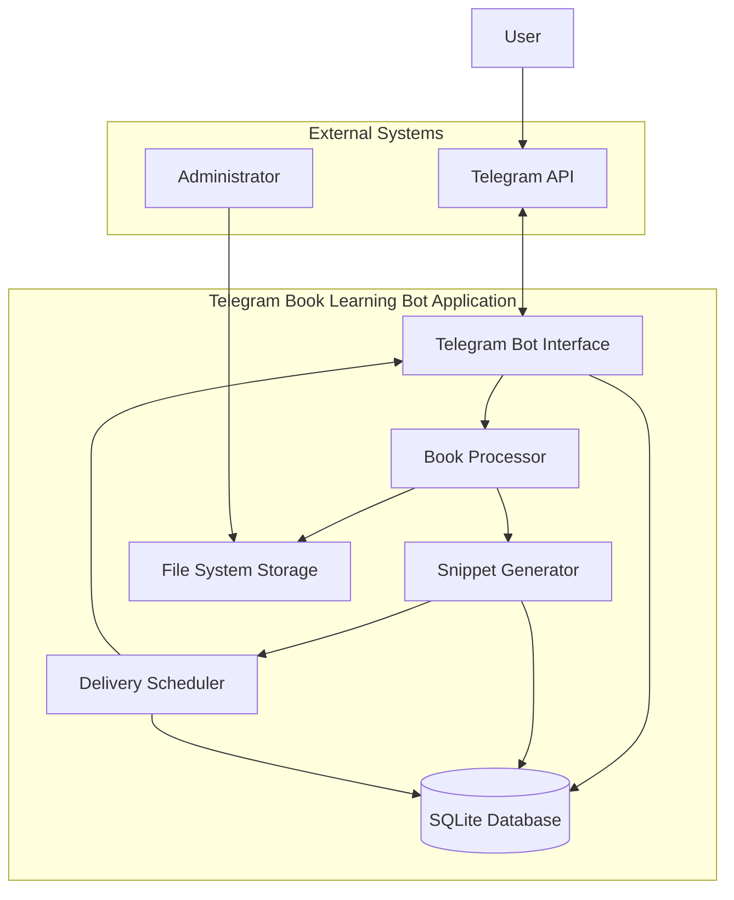

# Design Document - Telegram Book Learning Bot

## Overview

The Telegram Book Learning Bot is a single Python application that combines Telegram bot functionality with book processing and content delivery capabilities. The application extracts meaningful content from PDF and EPUB books, generates bite-sized learning snippets, and delivers them to users on a personalized schedule through Telegram's messaging platform.

The system follows a monolithic architecture where all components - bot interface, book processing, snippet generation, scheduling, and data persistence - are integrated into a single executable application. This approach simplifies deployment, reduces operational complexity, and ensures tight integration between all system components.

## Architecture

### High-Level Architecture



### Component Responsibilities

- **Telegram Bot Interface**: Handles all user interactions, command processing, and message delivery
- **Book Processor**: Extracts text content from PDF and EPUB files using PyPDF2 and EbookLib
- **Snippet Generator**: Analyzes extracted text and creates 1-2 paragraph learning snippets using NLTK
- **Delivery Scheduler**: Manages automated snippet delivery based on user preferences and schedules
- **SQLite Database**: Stores user profiles, book metadata, snippets, and progress tracking
- **File System Storage**: Stores uploaded book files and processed content

## Components and Interfaces

### Telegram Bot Interface

**Primary Functions:**
- Command processing (/start, /help, /next, /schedule, /pause)
- User authentication and profile management
- Message formatting and delivery
- Error handling and user feedback

**Key Methods:**
```python
class TelegramBotInterface:
    def handle_start_command(self, user_id: str) -> None
    def handle_help_command(self, user_id: str) -> None
    def handle_next_command(self, user_id: str) -> None
    def send_snippet(self, user_id: str, snippet: Snippet) -> bool
    def format_message(self, snippet: Snippet, progress: Progress) -> str
```

### Book Processor

**Primary Functions:**
- PDF text extraction using PyPDF2
- EPUB text extraction using EbookLib
- Content cleaning and normalization
- Error handling for corrupted files

**Key Methods:**
```python
class BookProcessor:
    def extract_pdf_text(self, file_path: str) -> str
    def extract_epub_text(self, file_path: str) -> str
    def clean_text(self, raw_text: str) -> str
    def validate_book_file(self, file_path: str) -> bool
```

### Snippet Generator

**Primary Functions:**
- Text analysis using NLTK for sentence and paragraph detection
- Snippet boundary identification
- Content quality assessment
- Sequential snippet ordering

**Key Methods:**
```python
class SnippetGenerator:
    def generate_snippets(self, text: str, book_id: str) -> List[Snippet]
    def identify_paragraph_boundaries(self, text: str) -> List[int]
    def assess_snippet_quality(self, snippet_text: str) -> float
    def create_snippet(self, text: str, position: int, book_id: str) -> Snippet
```

### Delivery Scheduler

**Primary Functions:**
- Schedule management and persistence
- Automated delivery triggering
- Timezone handling
- Delivery status tracking

**Key Methods:**
```python
class DeliveryScheduler:
    def set_user_schedule(self, user_id: str, schedule: Schedule) -> None
    def check_pending_deliveries(self) -> List[PendingDelivery]
    def execute_delivery(self, delivery: PendingDelivery) -> bool
    def pause_user_schedule(self, user_id: str) -> None
```

## Data Models

### Core Entities

```python
@dataclass
class User:
    user_id: str
    telegram_id: str
    username: str
    created_at: datetime
    last_active: datetime
    timezone: str = "UTC"

@dataclass
class Book:
    book_id: str
    title: str
    author: str
    file_path: str
    format: BookFormat  # PDF or EPUB
    upload_date: datetime
    processing_status: ProcessingStatus
    total_snippets: int

@dataclass
class Snippet:
    snippet_id: str
    book_id: str
    content: str
    position_in_book: int
    paragraph_count: int
    created_at: datetime

@dataclass
class UserProgress:
    user_id: str
    book_id: str
    current_position: int
    start_date: datetime
    completion_percentage: float
    is_completed: bool

@dataclass
class DeliverySchedule:
    user_id: str
    delivery_time: time
    frequency: DeliveryFrequency  # DAILY, WEEKLY, etc.
    timezone: str
    is_active: bool
    last_delivery: datetime
```

### Database Schema

```sql
-- Users table
CREATE TABLE users (
    user_id TEXT PRIMARY KEY,
    telegram_id TEXT UNIQUE NOT NULL,
    username TEXT,
    created_at TIMESTAMP DEFAULT CURRENT_TIMESTAMP,
    last_active TIMESTAMP,
    timezone TEXT DEFAULT 'UTC'
);

-- Books table
CREATE TABLE books (
    book_id TEXT PRIMARY KEY,
    title TEXT NOT NULL,
    author TEXT,
    file_path TEXT NOT NULL,
    format TEXT NOT NULL,
    upload_date TIMESTAMP DEFAULT CURRENT_TIMESTAMP,
    processing_status TEXT DEFAULT 'pending',
    total_snippets INTEGER DEFAULT 0
);

-- Snippets table
CREATE TABLE snippets (
    snippet_id TEXT PRIMARY KEY,
    book_id TEXT NOT NULL,
    content TEXT NOT NULL,
    position_in_book INTEGER NOT NULL,
    paragraph_count INTEGER DEFAULT 1,
    created_at TIMESTAMP DEFAULT CURRENT_TIMESTAMP,
    FOREIGN KEY (book_id) REFERENCES books (book_id)
);

-- User progress table
CREATE TABLE user_progress (
    user_id TEXT NOT NULL,
    book_id TEXT NOT NULL,
    current_position INTEGER DEFAULT 0,
    start_date TIMESTAMP DEFAULT CURRENT_TIMESTAMP,
    completion_percentage REAL DEFAULT 0.0,
    is_completed BOOLEAN DEFAULT FALSE,
    PRIMARY KEY (user_id, book_id),
    FOREIGN KEY (user_id) REFERENCES users (user_id),
    FOREIGN KEY (book_id) REFERENCES books (book_id)
);

-- Delivery schedules table
CREATE TABLE delivery_schedules (
    user_id TEXT PRIMARY KEY,
    delivery_time TEXT NOT NULL,
    frequency TEXT NOT NULL,
    timezone TEXT DEFAULT 'UTC',
    is_active BOOLEAN DEFAULT TRUE,
    last_delivery TIMESTAMP,
    FOREIGN KEY (user_id) REFERENCES users (user_id)
);
```
## Correctness Properties

*A property is a characteristic or behavior that should hold true across all valid executions of a system-essentially, a formal statement about what the system should do. Properties serve as the bridge between human-readable specifications and machine-verifiable correctness guarantees.*

### Property Reflection

After analyzing all acceptance criteria, several properties can be consolidated to eliminate redundancy:

- Properties 2.1 and 2.2 (PDF and EPUB extraction) can be combined into a single "Book text extraction" property
- Properties 4.2 and 4.5 (scheduled delivery and timezone handling) can be combined into a comprehensive "Scheduled delivery accuracy" property
- Properties 6.1, 6.3, and 6.4 (error handling scenarios) can be consolidated into a "Error handling consistency" property

### Core Properties

**Property 1: Command error handling consistency**
*For any* unrecognized command sent to the Application, the response should contain both an error message and suggestions for valid commands
**Validates: Requirements 1.3**

**Property 2: User profile creation**
*For any* new Telegram user ID interacting with the Application, a user profile should be created and stored with that Telegram ID
**Validates: Requirements 1.4**

**Property 3: Book text extraction**
*For any* valid book file (PDF or EPUB), the Application should successfully extract readable text content
**Validates: Requirements 2.1, 2.2**

**Property 4: Snippet generation consistency**
*For any* extracted book text, the generated snippets should each contain 1-2 paragraphs and be stored with sequential position markers
**Validates: Requirements 2.3, 2.4**

**Property 5: Processing error handling**
*For any* corrupted or invalid book file, the Application should log the error and mark the book status as failed
**Validates: Requirements 2.5**

**Property 6: Snippet formatting consistency**
*For any* snippet delivered to a user, the message should include proper paragraph formatting, book metadata (title and author), and progress information
**Validates: Requirements 3.1, 3.2, 3.3**

**Property 7: Sequential snippet delivery**
*For any* user request for the next snippet, the Application should deliver the snippet at the next sequential position in the book
**Validates: Requirements 3.4**

**Property 8: Message length compliance**
*For any* generated snippet, the content should not exceed Telegram's maximum message length limit
**Validates: Requirements 3.5**

**Property 9: Schedule persistence**
*For any* user-defined delivery schedule, the schedule settings should be stored and retrievable from the database
**Validates: Requirements 4.1**

**Property 10: Scheduled delivery accuracy**
*For any* active delivery schedule, when the scheduled time arrives (accounting for user timezone), the next snippet should be automatically delivered
**Validates: Requirements 4.2, 4.5**

**Property 11: Immediate delivery override**
*For any* user request for immediate snippet delivery, the next snippet should be delivered regardless of the current schedule status
**Validates: Requirements 4.3**

**Property 12: Schedule pause functionality**
*For any* user who pauses their delivery schedule, automatic deliveries should stop until the schedule is resumed
**Validates: Requirements 4.4**

**Property 13: Progress tracking consistency**
*For any* snippet delivery to a user, the user's current position in the book should be updated to reflect the delivered snippet
**Validates: Requirements 5.1**

**Property 14: Progress initialization**
*For any* user starting a new book, progress tracking should be initialized with position 0 and 0% completion
**Validates: Requirements 5.2**

**Property 15: Progress resumption**
*For any* user returning to the Application, snippet delivery should resume from their last recorded position in the book
**Validates: Requirements 5.3**

**Property 16: Book completion handling**
*For any* user who receives the final snippet of a book, the book should be marked as completed and a congratulatory message should be sent
**Validates: Requirements 5.4**

**Property 17: Progress persistence**
*For any* user progress data, the information should survive Application restarts and remain consistent
**Validates: Requirements 5.5**

**Property 18: Error handling consistency**
*For any* system error (corrupted files, connection failures, database errors, data corruption), the Application should log the error and maintain system stability
**Validates: Requirements 6.1, 6.2, 6.3, 6.4**

**Property 19: Input validation security**
*For any* user input received by the Application, the input should be validated to prevent security vulnerabilities
**Validates: Requirements 6.5**

## Error Handling

### Error Categories and Responses

**Book Processing Errors:**
- Corrupted PDF/EPUB files: Log error, mark book as failed, notify administrator
- Unsupported file formats: Return user-friendly error message
- Text extraction failures: Attempt alternative extraction methods, fallback to manual processing flag

**Telegram API Errors:**
- Connection timeouts: Implement exponential backoff retry mechanism (1s, 2s, 4s, 8s, max 30s)
- Rate limiting: Queue messages and respect Telegram's rate limits
- Invalid bot token: Log critical error and halt operations

**Database Errors:**
- Connection failures: Implement connection pooling and retry logic
- Data corruption: Attempt recovery using backup mechanisms
- Constraint violations: Log error and provide fallback functionality

**User Input Errors:**
- Invalid commands: Provide helpful error messages with command suggestions
- Malformed data: Sanitize input and request correction
- Security threats: Log security events and block suspicious activity

### Recovery Mechanisms

**Data Recovery:**
- Automatic database backups every 24 hours
- Transaction rollback for failed operations
- User progress reconstruction from delivery history

**Service Recovery:**
- Graceful degradation when external services are unavailable
- Local caching of critical data
- Manual override capabilities for administrators

## Testing Strategy

### Dual Testing Approach

The testing strategy employs both unit testing and property-based testing to ensure comprehensive coverage:

**Unit Testing:**
- Specific command interactions (/start, /help responses)
- Integration points between components
- Error condition handling with known inputs
- Database operations with sample data

**Property-Based Testing:**
- Universal properties that should hold across all inputs using the Hypothesis library for Python
- Each property-based test will run a minimum of 100 iterations
- Each test will be tagged with comments referencing the design document property

**Property-Based Testing Requirements:**
- Library: Hypothesis (Python property-based testing library)
- Minimum iterations: 100 per property test
- Test tagging format: `**Feature: telegram-book-bot, Property {number}: {property_text}**`
- Each correctness property must be implemented by a single property-based test

**Testing Framework Configuration:**
```python
# Example property-based test structure
from hypothesis import given, strategies as st
import pytest

@given(st.text(min_size=1))
def test_property_1_command_error_handling(**Feature: telegram-book-bot, Property 1: Command error handling consistency**):
    # Test implementation
    pass
```

### Test Coverage Areas

**Core Functionality Tests:**
- Book processing (PDF/EPUB extraction)
- Snippet generation and formatting
- User progress tracking
- Delivery scheduling

**Integration Tests:**
- Telegram bot API interactions
- Database operations
- File system operations
- End-to-end user workflows

**Performance Tests:**
- Response time validation (3-second requirement)
- Memory usage during book processing
- Database query optimization

**Security Tests:**
- Input validation and sanitization
- SQL injection prevention
- File upload security
- User data protection