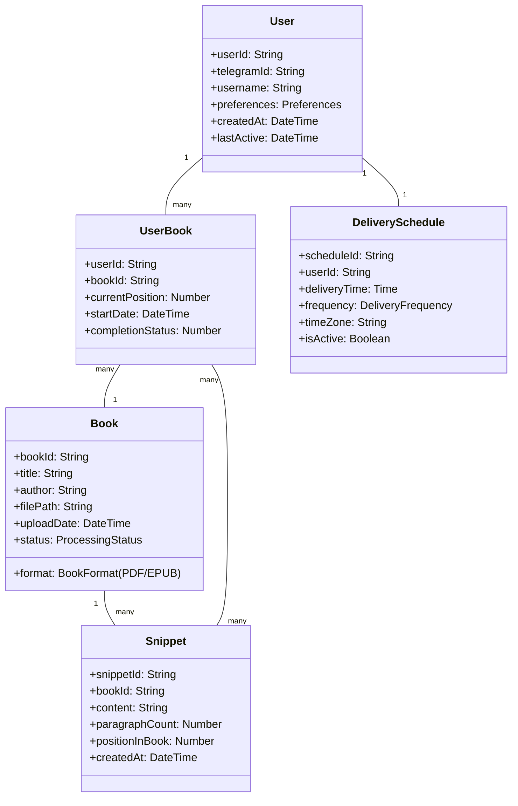

# Telegram Book Learning Bot - Master Plan

## 1. App Overview and Objectives

### Concept
A Telegram bot that delivers bite-sized learning snippets (1-2 paragraphs) automatically extracted from **PDF and EPUB books** to individual users, enabling microlearning through easily digestible content.

### Core Objectives
- Enable users to learn from books in small, manageable chunks
- Automate the extraction and delivery of meaningful content snippets
- Provide a convenient learning experience through Telegram
- Support individual learning preferences and schedules
- **Support multiple book formats (PDF and EPUB)**

## 3. Core Features and Functionality

### 3.1 Book Processing System
- **Pre-uploaded Books**: Process books uploaded to server in advance
- **Text Extraction**: Convert book content to machine-readable text
- **Basic Content Analysis**: Identify sections and paragraphs
- **Simple Cleaning**: Remove basic non-content elements

### 3.2 Snippet Generation Engine
- **Simple Extraction**: Basic algorithm to identify 1-2 paragraph sections
- **Sequential Delivery**: Send snippets in book order
- **Basic Formatting**: Simple text formatting for Telegram

### 3.3 Telegram Bot Interface
- **Simple Commands**: Basic bot commands (/start, /next, /help)
- **Content Delivery**: Reliable message sending to single user

### 3.4 Simple State Management
- **Basic Progress Tracking**: Track current position in book
- **Single User Focus**: No multi-user management needed

### 3.5 Simple Delivery
- **Sequential Scheduling**: Send snippets in order
- **Basic Timing**: Simple delivery schedule

## 4. High-Level Technical Stack Recommendations

### Backend Services
- **Programming Language**: Python (minimal dependencies approach)
- **PDF Processing**: PyPDF2 (lightweight, pure Python)
- **EPUB Processing**: EbookLib (minimal, Python-native)
- **NLP Processing**: NLTK (core functionality only)
- **Database**: SQLite (embedded, zero-configuration)
- **Hosting**: Simple Python hosting (Heroku, PythonAnywhere, or basic VPS)

### Telegram Integration
- **Telegram Bot API**: Official API for bot functionality
- **Webhook Setup**: For real-time message handling
- **Message Formatting**: Telegram-specific markdown formatting

### Development Approach
- **Single Script**: Simple Python script
- **Dependency Management**: Using `uv` for Python package management
- **Minimal Dependencies**: Only essential libraries
- **Direct Execution**: Run as simple Python program

## 5. Conceptual Data Model

### Core Entities

## 6. User Interface Design Principles

### Telegram Bot Interface
- **Simple Command Structure**: `/start`, `/help`, `/upload`, `/schedule`, `/feedback`
- **Clear Instructions**: Step-by-step guidance for new users
- **Visual Feedback**: Confirmation messages and progress indicators
- **Error Handling**: Friendly error messages with recovery options

### Content Presentation
- **Readable Formatting**: Proper paragraph breaks and spacing
- **Source Attribution**: Clear indication of book title and author
- **Progress Indicators**: Show position within the book
- **Navigation Options**: Allow users to request next/previous snippets

## 7. Security Considerations

### Data Protection
- **User Privacy**: Minimal personal data collection
- **Content Security**: Secure storage of uploaded PDFs
- **Access Control**: User-specific content access
- **Data Retention**: Clear policies on data storage duration

### System Security
- **API Authentication**: Secure Telegram bot token management
- **Input Validation**: Protection against malicious uploads
- **Rate Limiting**: Prevent abuse of bot functionality
- **Encryption**: Secure data in transit and at rest

## 9. Potential Challenges and Solutions

### Challenge 1: PDF Content Extraction
- **Issue**: Complex PDF layouts, images, and formatting
- **Solution**: Use multiple extraction methods with fallback options

### Challenge 2: Meaningful Snippet Selection
- **Issue**: Identifying truly valuable 1-2 paragraph sections
- **Solution**: Combine NLP analysis with user feedback loop

This masterplan provides a comprehensive blueprint for your Telegram Book Learning Bot. It covers all major aspects from technical implementation to user experience, with a focus on creating a robust, scalable system that delivers value to users through bite-sized learning experiences.